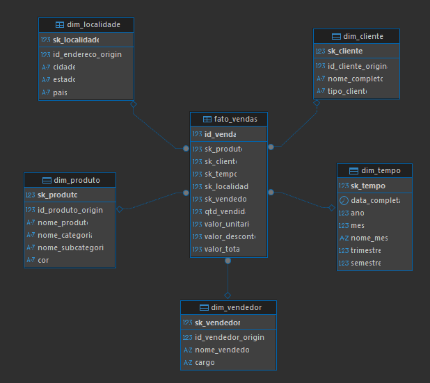

# Projeto de Engenharia de Dados: Data Warehouse AdventureWorks

Este projeto consiste na construção de um **Data Warehouse (DW)** completo, desde a modelagem multidimensional até a orquestração de pipelines ETL utilizando **Apache Airflow**, **Docker** e **PostgreSQL**.

O objetivo foi transformar dados transacionais (OLTP) do banco de dados fictício **AdventureWorks** em um modelo analítico (OLAP) capaz de responder a indicadores de negócio.

---

## 🛠️ Tecnologias Utilizadas

* **Linguagem:** Python 3.x (Pandas, SQLAlchemy)
* **Orquestração:** Apache Airflow 3.x (via Docker)
* **Banco de Dados (DW):** PostgreSQL 16
* **Containerização:** Docker & Docker Compose
* **IDE/Ferramentas:** VS Code, DBeaver

---

## 🏗️ Arquitetura e Modelagem

Foi adotado o esquema **Star Schema (Modelo Estrela)**, ideal para consultas analíticas rápidas.

### O Modelo
* **Fato:** `Fato_Vendas` (Granularidade: Item do pedido)
* **Dimensões:**
    * `Dim_Produto` (Dados de produtos, categorias e subcategorias)
    * `Dim_Cliente` (Dados unificados de Pessoa e Cliente)
    * `Dim_Vendedor` (Dados de funcionários e vendas)
    * `Dim_Localidade` (País, Estado e Cidade)
    * `Dim_Tempo` (Gerada via código para análises temporais)

> 

---

## 🔄 Pipeline ETL (Extract, Transform, Load)

Os processos de ETL foram desenvolvidos utilizando DAGs (Directed Acyclic Graphs) no Airflow, utilizando a biblioteca **Pandas** para transformação de dados em memória.

### Fluxo das DAGs:
1.  **Extract:** Leitura de arquivos CSV brutos (`SalesOrder`, `Customer`, `Product`, etc.) e leitura de tabelas do próprio banco (para Lookups).
2.  **Transform:**
    * Limpeza de dados nulos.
    * Renomeação de colunas conflitantes (ex: `Name` de País vs `Name` de Estado).
    * Cruzamento de dados (Joins) para desnormalização das dimensões.
    * Geração de chaves substitutas (Surrogate Keys).
    * Cálculo de métricas (Valor Total, Descontos).
3.  **Load:** Carregamento incremental (`append`) ou total (`truncate/insert`) no PostgreSQL.

### Lista de DAGs:
* `etl_dim_produto`: Consolida Produto, Categoria e Subcategoria.
* `etl_dim_cliente`: Unifica tabelas Customer e Person.
* `etl_dim_localidade`: Hierarquia de Endereço, Estado e País.
* `etl_dim_vendedor`: Cruzamento de Funcionário e Vendedor.
* `etl_dim_tempo`: Geração automática de calendário (2010-2025).
* **`etl_fato_vendas`**: A DAG principal que cruza os pedidos com todas as dimensões acima.

---

## 📊 Indicadores de Negócio (KPIs)

O Data Warehouse responde a 10 perguntas chaves de negócio, validadas via SQL:

1.  Faturamento Bruto Total
2.  Faturamento Líquido Total
3.  Ticket Médio
4.  Volume Total de Vendas (Quantidade)
5.  Top 5 Produtos Mais Vendidos
6.  Performance de Vendas por País
7.  Sazonalidade Mensal de Vendas
8.  Vendas por Categoria de Produto
9.  Total de Descontos Concedidos
10. Ranking de Melhores Vendedores

---

## 🚧 Desafios e Soluções

Durante o desenvolvimento, diversos desafios técnicos foram superados:

### 1. Mapeamento de Volumes no Docker (Windows)
* **Problema:** O Airflow rodando no Docker não conseguia enxergar os arquivos `.py` e `.csv` locais devido a caminhos absolutos incorretos no Windows.
* **Solução:** Ajuste no `docker-compose.yaml` para usar caminhos relativos (`./dags:/opt/airflow/dags`), garantindo o espelhamento correto das pastas.

### 2. Dependências Python (Pandas)
* **Problema:** A imagem oficial do Airflow não inclui as bibliotecas `pandas` e `sqlalchemy` por padrão, gerando erros de importação ("ModuleNotFoundError").
* **Solução:** Configuração da variável de ambiente `_PIP_ADDITIONAL_REQUIREMENTS` no Docker Compose para instalar as dependências automaticamente na inicialização dos containers.

### 3. Conectividade e Permissões
* **Problema:** O container do Airflow perdia a conexão com o banco após reinicializações ("Connection ID not found").
* **Solução:** Criação persistente da conexão `postgres_dw` via interface do Airflow e configuração correta do host interno do Docker (`postgres` ou `host.docker.internal`).

---

## 🚀 Como executar este projeto

### Pré-requisitos
* Docker e Docker Compose instalados.
* Arquivos CSV do AdventureWorks na pasta `dags/data`.

### Passo a Passo
1.  Clone o repositório:
    ```bash
    git clone https://github.com/Cgmc18/ETL-AirFlow-AdventureWorks.git
    ```
2.  Suba o ambiente Docker:
    ```bash
    docker-compose up -d
    ```
3.  Crie as tabelas no Banco de Dados (Postgres) executando o script SQL localizado em `/sql/create_dw_tables.sql`.
4.  Acesse o Airflow em `http://localhost:8080`.
5.  Configure a conexão `postgres_dw` no Admin do Airflow.
6.  Ative e execute as DAGs na ordem: Dimensões -> Fato.

---

### Autor
Ana Carolina Gomes.